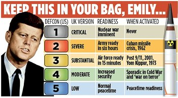

# TODO / Agile Board

LEGEND

**Prioritization:**

DEFCON 1 = Critical

DEFCON 2 = High

DEFCON 3 = Medium

DEFCON 4 = Low

DEFCON 5 = Very Low

**Difficulty:**

SP = Story Points (1-10)

## DEFCON 1
- <s>Create Contribution Docs and make a create-hook script</s>

## DEFCON 2
- Add tsc watch to the API (8 SP)
- Instead of writing over the tsconfig, create temp tsconfig and direct the tsc compiler to the temp config by modifying process args (7 SP)
- Update documentation to show that developers have access to creating local hooks and using hooks from urls (1 SP)

## DEFCON 3
- Add documentation place for each hook and update create hook script (2 SP)
- Add Babel to target lower version (4 SP)
- Make tests run locally instead of needing a dev publish (7 SP)
- Add arguments (4 SP)

## DEFCON 4
- Only cache hooks that are requested, then take from GitHub/put hooks in npmignore (6 SP)
- Add lintr (3 SP)
- Add GitHub actions (2 SP)
- Allow asynchronous calls (2 SP)

## DEFCON 5
- Find a way to tell editors to ignore custom properties in tsconfig (9 SP)
